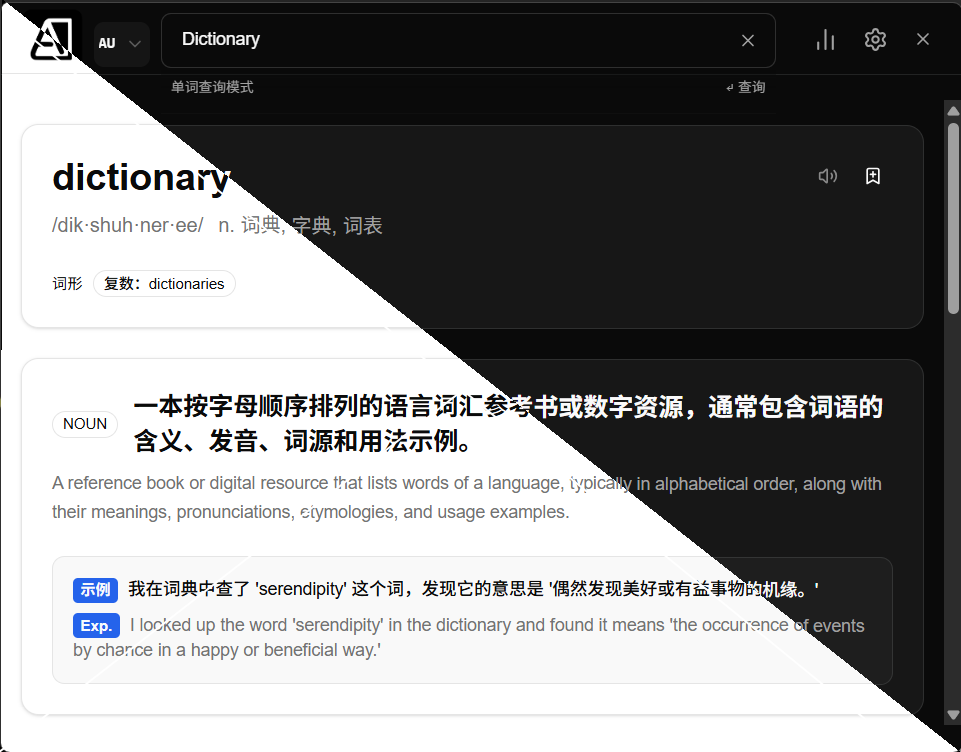

# Aictionary

快速且异常好用的词典 App，基于 **Tauri 2 + React**，提供本地离线词库和可选大模型释义，专注于「查词体验」这件小事。




## 功能特性

- **详细易懂的中文释义**  
  基于开源英汉词库和自定义处理，释义不仅给出“意思”，还尽量解释用法、语境和常见搭配。

- **快速离线查询**  
  常用高频词会预先缓存到本地，即使离线也能秒开释义；词库更新通过 GitHub Release 一键下载。

- **大语言模型驱动补充释义**  
  当本地词库没有某个词条时，可以调用配置好的 LLM（如 OpenAI 等）生成一份中文解释和例句，适合技术 / 学术场景。

- **跨平台桌面应用**  
  基于 Tauri 框架，提供 **Windows / macOS / Linux** 原生安装包（dmg / msi / AppImage 等）。

- **使用统计与个人词库**  
  记录查词历史、频次等统计信息，帮助你回顾高频生词、构建个人词库。

- **细节体验优化**  
  - 支持键盘快捷键快速打开 / 关闭、查询当前剪贴板内容等；
  - 查询记录自动缓存，可随时刷新词条以获取最新释义；
  - 主题、语言、LLM 提供商、快捷键等都可在设置里集中配置。

- **本地AI翻译推理** 
  - 支持本地 AI 模型推理，可在设置中配置使用
  - 支持本地提示词及专业术语管理

---

## 下载与安装

### 从 GitHub Releases 安装

前往项目的 **Releases 页面**，每次发布都会为不同平台生成对应安装包，命名规则统一为：

`Aictionary-[version]_[os]_[arch].[extension]`

#### macOS

1. 下载对应架构的 `.dmg` 文件；
2. 打开 dmg，将 `Aictionary` 拖入 `Applications` 即可；
3. 首次运行如遇到 Gatekeeper 提示，可在「系统设置 → 隐私与安全性」中允许打开。

> [!IMPORTANT]
> 如果提示「应用损坏」之类的，请运行 `xattr -cr /Applications/Aictionary-[版本]_[架构].app` （注意根据版本号修改命令的文件名）

#### Windows

1. 优先下载 `.msi` 安装包；若 Release 中只有 `.exe`，则下载该安装器；
2. 双击运行并按提示完成安装；
3. 安装完成后可在开始菜单中搜索 `Aictionary` 启动。

#### Linux（AppImage）

1. 下载 `.AppImage` 文件，例如 `Aictionary-0.1.0_linux_x86_64.AppImage`；
2. 赋予可执行权限并运行：

   ```bash
   chmod +x Aictionary-0.1.0_linux_x86_64.AppImage
   ./Aictionary-0.1.0_linux_x86_64.AppImage
   ```

> 初次使用，建议在「设置 → 词典与 LLM」中：
> - 先下载/更新本地词库（会通过内置下载器从 GitHub 拉取 zip 并自动解压）；  
> - 再配置 LLM 提供商与 API Key，当本地词库缺少词条时会自动调用大模型补充中文释义。

### Fish Audio 语音播放配置

AIctionary 支持通过 [Fish Audio](https://fish.audio/) 生成更自然的 TTS 发音用于单词朗读。开启方式：

1. 在 Fish Audio 控制台创建或获取 API Key；
2. 打开应用内「设置 → 音频」，填写：
   - **API Key**：Fish Audio 提供的密钥，存储在本地；
   - **TTS 模型**：默认 S1（最新高质量），也可选 legacy 模型；
   - **Reference ID（可选）**：若有自定义语音克隆，可填对应的 reference_id；留空则使用官方默认女声；
3. 保存设置后，重新在单词卡片中点击喇叭按钮，会自动：
   - 先检查是否已有缓存音频；
   - 若无缓存，则调用 Fish Audio 生成语音并写入 `%LOCALAPPDATA%\\aictionary\\dictionary.db\\audio\\`（macOS，Windows/Linux 路径类似），下次播放直接走缓存。

> **注意**：Fish Audio API Key 会被写入设备本地的设置存储，不会上传到网络，请自行妥善保管与刷新密钥。


### 与 Anki 同步卡片（AnkiConnect）

AIctionary 可以把任意单词卡片一键推送到桌面版 Anki，生成排版统一、含中英释义/例句/对比分析的双语卡片。依赖的是社区常用的 [AnkiConnect](https://foosoft.net/projects/anki-connect/) 插件，因此在使用前请确保：

1. **已在 Anki 中安装并启用 AnkiConnect**，并保持 Anki 客户端开启；
2. 在 AIctionary 内打开「设置 → Anki」，填入：
   - **API 地址**（默认 `http://127.0.0.1:8765`，除非你修改过插件端口）；
   - **牌组名称**：可以填现有牌组或新名称（若不存在会自动创建）；
   - **卡片主题**：选择导出的卡片是浅色或深色背景；
3. 配置完成后，回到单词详情卡片，点击发音按钮旁的 **“保存到 Anki”**（书签图标）即可写入卡片；
4. 每张卡片会生成 Front/Back 两个面，包含：单词、音标、简洁释义、词形、详解及例句、词义比较等内容，同时自动附加 `aictionary` 标签。

如果牌组尚未存在，应用会先调用 AnkiConnect 创建；写入失败时会在应用内弹出 toast，方便重新尝试。

---

## 使用提示

- **键盘操作优先**  
  应用尽量为常用操作提供快捷键（查词、切换结果、刷新词条等），阅读英文资料时几乎不需要鼠标。

- **本地缓存与历史记录**  
  所有查过的词都会写入本地缓存，可离线查看；支持按需刷新，确保释义与在线词库同步。

- **统计与复习**  
  统计页面展示一段时间内的查词量、高频生词等，适合作为「背单词/复习清单」。

- **界面与语言**  
  支持深浅色主题切换、强调色选择，以及中英文界面（基于 `react-i18next`），都在设置中配置。

---

## 技术栈

- **前端**
  - React 19
  - Vite
  - TypeScript
  - Tailwind CSS v4 + shadcn/ui
  - Jotai（集中设置状态管理）
  - react-hook-form + zod 表单校验
  - react-router v7

- **桌面端 / 后端**
  - Tauri 2（Rust + WebView）

---

## 开发构建

### 环境准备

根据 Tauri 2 官方文档，需要：

- **通用**
  - Node.js / Bun
  - Rust（stable toolchain）
  - Tauri CLI（本项目通过 devDependencies 已内置）

- **Linux 额外依赖**（Debian/Ubuntu）：
  ```bash
  sudo apt-get update
  sudo apt-get install -y \
    libwebkit2gtk-4.0-dev \
    libwebkit2gtk-4.1-dev \
    libappindicator3-dev \
    librsvg2-dev \
    patchelf
  ```

### 启动开发环境

```bash
# 安装依赖
bun install

# 启动前端开发服务器（Vite）
bun run dev

# 启动 Tauri 开发模式（桌面窗口）
bun tauri dev
```

> 一般情况下直接运行 `bun tauri dev` 即可，它会按照 `src-tauri/tauri.conf.json` 中的配置先执行 `bun run build` / 使用 dev server。

### 构建发行版

```bash
# 构建当前平台的 Tauri 安装包
bun tauri build
```

构建完成后，Tauri 的所有原始产物都会放在：

- `src-tauri/target/release/bundle/`

GitHub Actions 会在 CI 中对 macOS / Windows / Linux 分别执行构建，并将这些文件重命名为：

- `Aictionary-[version]_[os]_[arch].[extension]`

然后自动上传到 GitHub Release。

---

## 反馈与贡献

- 欢迎通过 **Issues** 反馈 Bug 或功能建议；
- 也非常欢迎 **PR**：
  - 尽量附上改动说明或截图，方便快速 Review；
  - 用户可见文案请记得同步更新中/英翻译；
- 对以下方向感兴趣都可以一起讨论：
  - 扩展或替换词库来源；
  - 支持更多平台或打包格式；
  - 接入新的 LLM 提供商，优化释义风格或对话能力。

---

感谢使用 Aictionary，愿它能让你的查词过程更轻松一点点。
